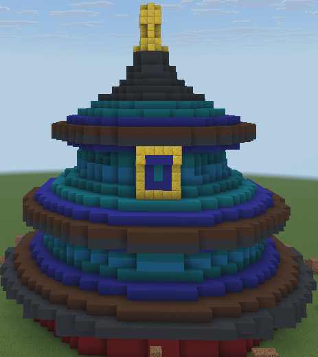
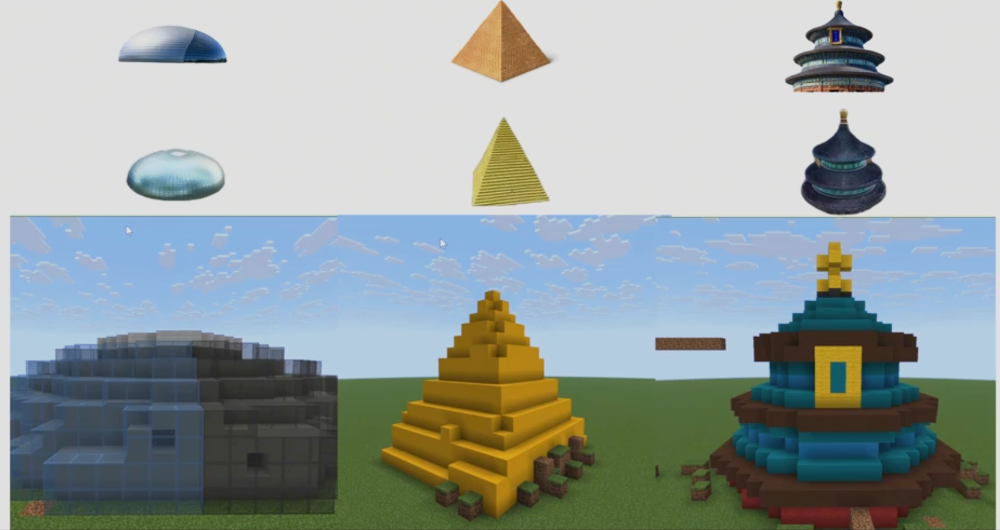
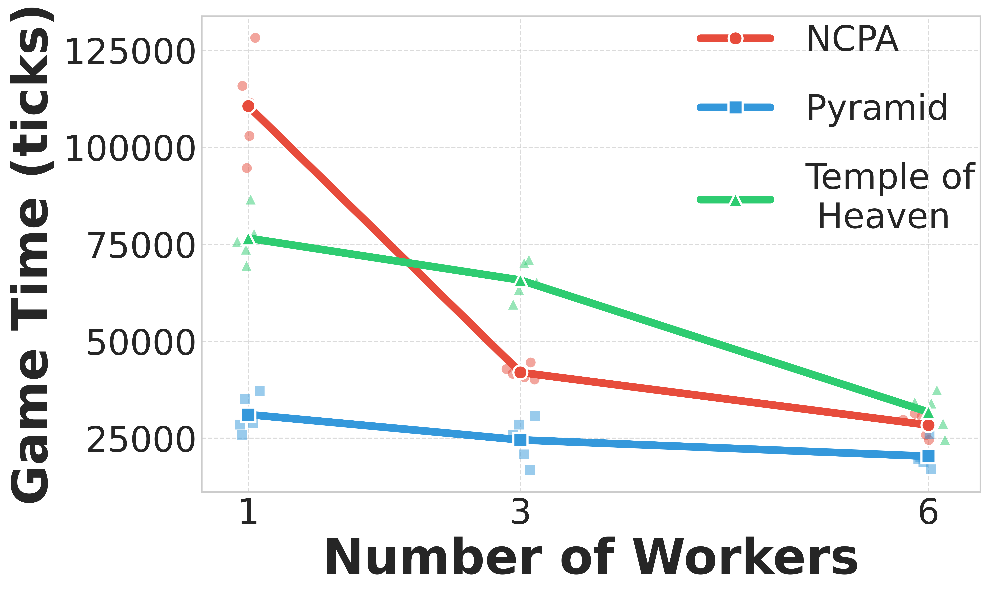
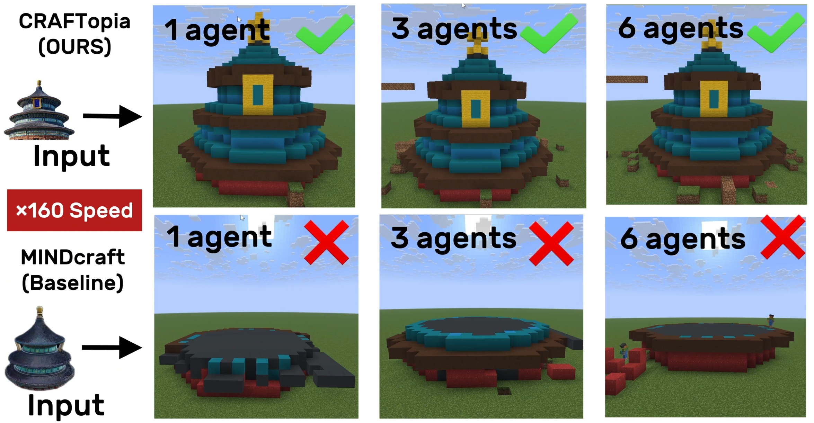
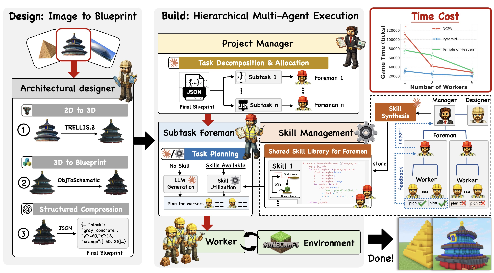

  

  # CraftUtopia

  **一个将 2D 图像转化为协同 3D 建造的多智能体 Minecraft 构建流水线**

  

    <a href="README.md"><b>English</b></a> · <a href="README_zh.md"><b>中文</b></a>
  

  

    
    
    
  

  

    <a href="#概览">概览</a> ·
    <a href="#演示视频">演示视频</a> ·
    <a href="#结果">结果</a> ·
    <a href="#项目介绍">项目介绍</a> ·
    <a href="#系统架构">系统架构</a> ·
    <a href="#机制">机制</a> ·
    <a href="#流程">流程</a> ·
    <a href="#角色">角色</a>
  

---

## 概览

> CraftUtopia 通过“图像到蓝图”的设计阶段与分层多智能体的执行阶段，完成 Minecraft 中的大规模协作建造。系统以共享技能与结构化任务分解为核心，实现并行、互不干扰的构建。

### 核心能力

- 图像到蓝图的转换，实现精确的方块级建造。
- 分层协作，扩大规模时避免相互冲突。
- 管理者-工头-工人式并行执行。
- 技能蒸馏，复用重复操作以减少规划开销。

## 演示视频

  

也可以从仓库中下载 MP4 和 MOV 格式的源文件（`demo.mp4`、`demo.mov`）。

---

## 结果

  <table width="90%">
  <tr>
  <td align="center"><b>成功率</b> 三项任务五次试验 <b>100%</b></td>
  <td align="center"><b>可扩展性</b> NCPA 完成时间 <b>6 人：比 3 人快 1.5x</b></td>
  <td align="center"><b>团队加速</b> NCPA 完成时间 <b>比 1 人快 3.9x</b></td>
  </tr>
  </table>

 

**论文与演示构建的主要结论：**

- **100% 成功率**：在 3 个建筑任务上进行 5 次试验，均可仅依赖单张 2D 图像完成。
- **基线对比优势**：MINDcraft 即使有完整 3D 蓝图，也无法完成天坛与国家大剧院，金字塔仅 5 次中成功 2 次。
- **可扩展性**：工人数量提升显著缩短完成时间（NCPA：6 人比 3 人快 1.5x，比 1 人快 3.9x）。
- **大规模建造**：可完成 40 层、近 2 万方块的超大蓝图。
- **多样化输入**：同一流程可从不同 PNG 图像复现多种建筑。

<table align="center" width="100%">
<tr>
<td align="center" width="50%">

 <b>大规模：</b>40 层蓝图，约 2 万方块。
</td>
<td align="center" width="50%">

 <b>多样化输入：</b>从不同 PNG 输入重建多样化建筑。
</td>
</tr>
<tr>
<td align="center" width="50%">

 <b>扩展性：</b>工人数量增加，完成时间下降。
</td>
<td align="center" width="50%">

 <b>基线对比：</b>CraftUtopia 成功完成，而 MINDcraft 失败。
</td>
</tr>
</table>

---

## 项目介绍

> CraftUtopia 面向开放世界中的协作建造任务，具有长时序、部分可观测和动态变化的环境特征，并且直接从**单张 2D 参考图像**进行建造，不依赖预定义模板。系统采用“设计-建造”两阶段流程，并通过分层协作与技能获取实现可扩展性。

### 我们解决的关键问题

- **开放世界设定**：长时序任务、部分可观测与非平稳动态。
- **模板依赖**：无需预定义模板或 3D 蓝图，仅基于 2D 图像。
- **规模瓶颈**：避免多工人带来的协作摩擦，提升整体效率。

---

## 系统架构

  

CraftUtopia 采用两阶段流程：**设计**将单张 2D 参考图像转换为 Minecraft 兼容的 3D 蓝图；**建造**将蓝图拆分为空间互不重叠的子任务并并行执行。

<table align="center" width="100%">
<tr>
<td width="50%" valign="top" align="center">

### 设计阶段
- 从 2D 图像重建 3D 模型（TRELLIS.2）。
- 转换为基于方块的蓝图（ObjToSchematic）。
- 由 LLM 生成包含方块类型与位置的结构文件。

</td>
<td width="50%" valign="top" align="center">

### 建造阶段
- **Manager -> Foreman -> Worker** 分层结构将任务划分为互不重叠区域。
- 工头为团队制定计划，工人执行方块放置。
- **技能获取**将重复操作提炼为共享技能，减少重复规划并加速建造。

</td>
</tr>
</table>

---

## 机制

CraftUtopia 依赖两大机制：

### 1) 分层协作（Manager -> Foreman -> Worker）
- 管理者将蓝图拆分为**空间互不重叠**的区域，并分配为团队级目标。  
- 工头在各自区域内制定计划并调度工人。  
- 工人执行局部方块放置并回传进度，减少跨团队干扰。

### 2) 技能获取与复用
- 工头在执行过程中识别重复动作流程。  
- 将流程上报给管理者，整理为共享技能库并分发给各团队。  
- 工头直接调用已学技能，替代频繁的 LLM 重规划，提升规模化效率与稳定性。

---

## 流程

1. **设计（2D -> 3D 蓝图）**
2. **建造（蓝图 -> 世界）**

<b>设计细节</b>

- 建筑设计者从 2D 图像重建 3D 模型。  
- 转换为 Minecraft 可执行的方块蓝图。  
- 导出结构化任务文件。

<b>建造细节</b>

- 项目经理拆分蓝图为互不冲突子任务。  
- 工头协调多工人并行建造。  
- 工人完成方块放置并回传进度。

---

## 角色

- **建筑设计者**：将 2D 输入转为可建造蓝图。
- **项目经理**：拆分任务并避免冲突。
- **工头**：规划与调度团队执行。
- **工人**：在游戏世界中完成建造。
