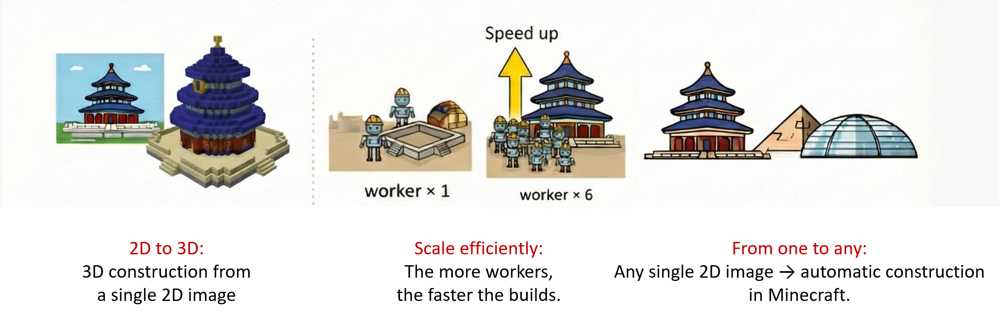

  

  # CraftUtopia

  **一个基于 LLM 的 MAS，在 Minecraft 中从 <b>单张 2D 图像</b> <b>构建 3D</b> 建筑，并随团队规模提升而 <b>高效扩展</b>。**

  

    <a href="README.md"><b>English</b></a> · <a href="README_zh.md"><b>中文</b></a>
  

  

    
    
    
  

  

    <a href="#演示视频">演示视频</a> ·
    <a href="#亮点">亮点</a> ·
    <a href="#概览">概览</a> ·
    <a href="#结果">结果</a> ·
    <a href="#项目介绍">项目介绍</a> ·
    <a href="#系统架构">系统架构</a> ·
    <a href="#机制">机制</a> ·
    <a href="#流程">流程</a> ·
    <a href="#角色">角色</a>
  

---

## 演示视频

  

也可以从仓库中下载 MP4 和 MOV 格式的源文件（`demo.mp4`、`demo.mov`）。

## 亮点

  

- 支持 <b>单张 2D 图像到 3D 建造</b>。
- 采用分层智能体架构（<b>manager -> foreman -> worker</b>）提升协作效率。
- 将工人的成功动作序列蒸馏为 <b>可复用的代码技能</b>。
- 三个代表性建筑实验中达到 <b>100% 建造成功率</b>。
- 具备良好扩展性：<b>人数越多，建造越快</b>。
- 展示强泛化能力，可适配 <b>任意建筑类型</b>。
- 呈现 <b>类人涌现行为</b>，如 <b>自主学习使用脚手架</b>。

## 概览

> CraftUtopia 通过“图像到蓝图”的设计阶段与分层多智能体的执行阶段，完成 Minecraft 中的大规模协作建造。系统以共享技能与结构化任务分解为核心，实现并行、互不干扰的构建。

### 核心能力

- 图像到蓝图的转换，实现精确的方块级建造。
- 分层协作，扩大规模时避免相互冲突。
- 管理者-工头-工人式并行执行。
- 技能蒸馏，复用重复操作以减少规划开销。

## 结果

- **一致成功：** CraftUtopia 仅用单张 2D 图像在三个构建任务上实现 100% 成功率。

  

- **高效扩展：** 随着工人数量增加，建造时间显著下降。

  

- **可靠执行：** MINDcraft 即便使用 3D 输入、任意智能体配置也无法完成建造；CraftUtopia 仅凭单张 2D 图像即可稳定完成。

  

-----

## 项目介绍

> CraftUtopia 面向开放世界中的协作建造任务，具有长时序、部分可观测和动态变化的环境特征，并且直接从**单张 2D 参考图像**进行建造，不依赖预定义模板。系统采用“设计-建造”两阶段流程，并通过分层协作与技能获取实现可扩展性。

### 我们解决的关键问题

- **开放世界设定**：长时序任务、部分可观测与非平稳动态。
- **模板依赖**：无需预定义模板或 3D 蓝图，仅基于 2D 图像。
- **规模瓶颈**：避免多工人带来的协作摩擦，提升整体效率。

---

## 系统架构

  

CraftUtopia 是面向 Minecraft 建造的分层多智能体系统。**管理者 -> 工头 -> 工人** 的协作层级将任务拆分为互不重叠的区域，协调执行并完成方块放置。技能蒸馏沉淀成功经验，减少重复规划并提升扩展性。
